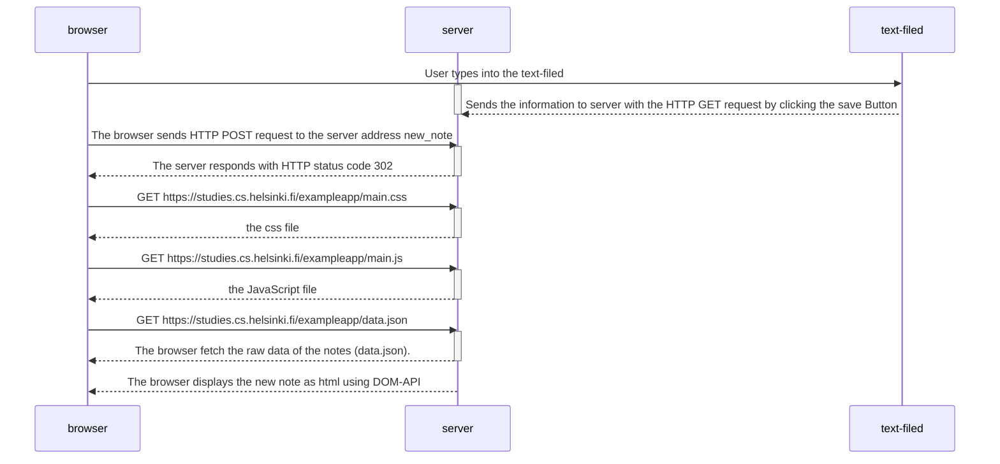
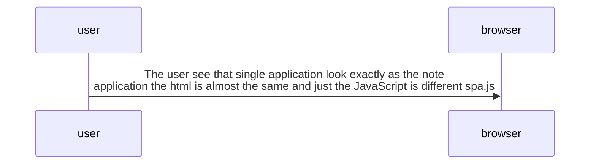
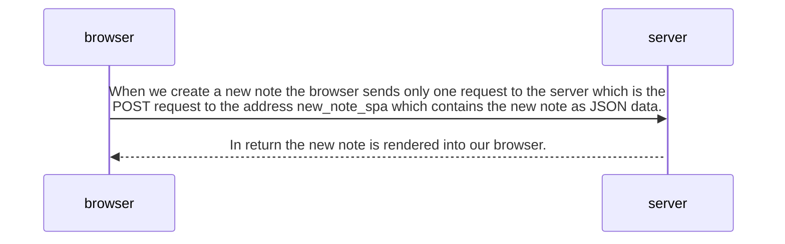

## sequenceDiagram

```mermaid
sequenceDiagram
    participant browser
    participant server

    browser->>text-filed: User types into the text-filed
    activate text-filed
    activate server
    text-filed-->>server: Sends the information to server with the HTTP GET request by clicking the save Button 
    deactivate server

    browser->>server: The browser sends HTTP POST request to the server address new_note
    activate server
    server-->>browser: The server responds with HTTP status code 302
    deactivate server

     browser->>server: GET https://studies.cs.helsinki.fi/exampleapp/main.css
    activate server
    server-->>browser: the css file
    deactivate server

    browser->>server: GET https://studies.cs.helsinki.fi/exampleapp/main.js
    activate server
    server-->>browser: the JavaScript file
    deactivate server

     browser->>server: GET https://studies.cs.helsinki.fi/exampleapp/data.json
    activate server
    server-->>browser: The browser fetch the raw data of the notes (data.json).
    deactivate server
    server-->>browser: The browser displays the new note as html using DOM-API
    
```

## sequenceDiagram

```mermaid
sequenceDiagram
    participant user
    participant browser
  user->>browser:The user see that single application look exactly as the note<br/> application the html is almost the same and just the JavaScript is different spa.js

```

## sequenceDiagram

```mermaid
sequenceDiagram
    participant browser
    participant server

    browser->>server:When we create a new note the browser sends only one request to the server which is the<br/> POST request to the address new_note_spa which contains the new note as JSON data.
    activate server
    server-->>browser: In return the new note is rendered into our browser.

```